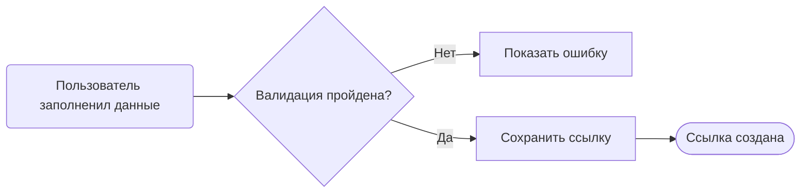
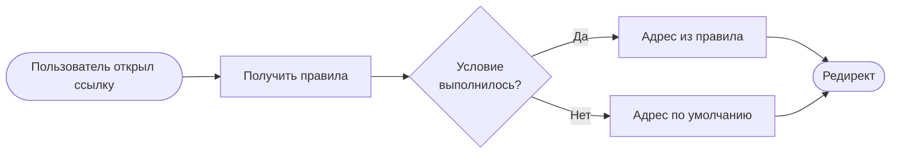
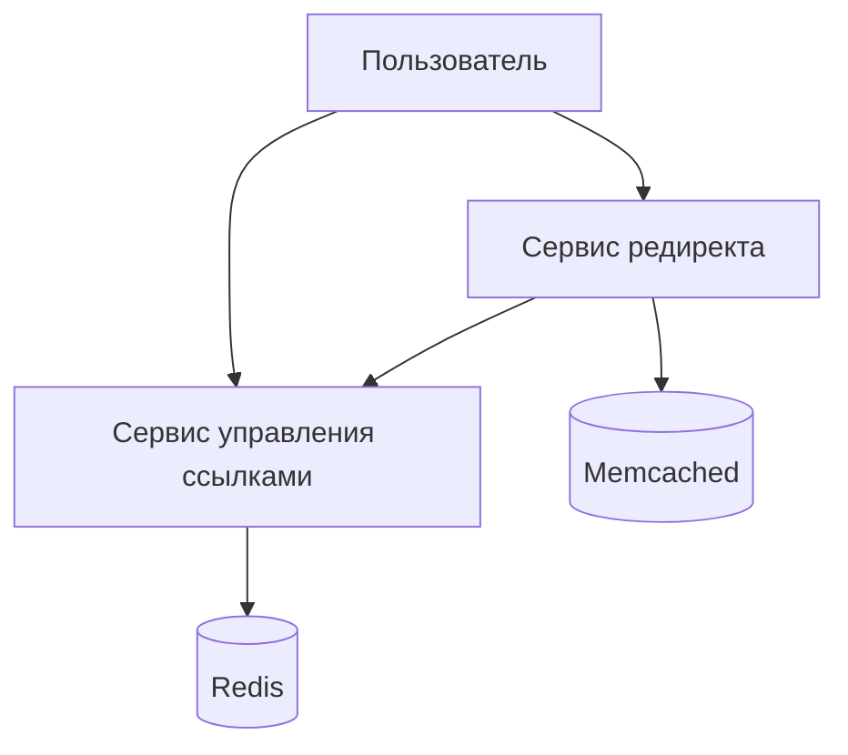
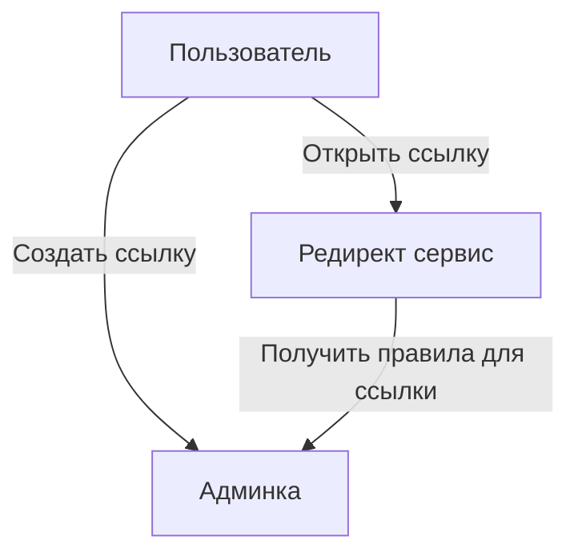
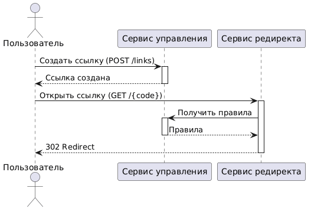

## Умные ссылки

Сервис умных ссылок с редиректом по условиям


### Установка
```
docker compose run --rm composer install --working-dir=admin
docker compose run --rm composer install --working-dir=redirect
```


### Запуск тестов
```
docker compose run --rm admin php vendor/bin/phpunit --coverage-text
docker compose run --rm redirect php vendor/bin/phpunit --coverage-text
```


### Бизнес процессы

#### 1. Создание ссылки



#### 2. Переход по ссылке




### функциональные процессы

Пользователь -> Создать ссылку
Пользователь -> Открыть ссылку

Сервис редиректа -> получить ссылку и правила по коду ссылке


### копонентная схема




### информационная схема




### описание интеграций


